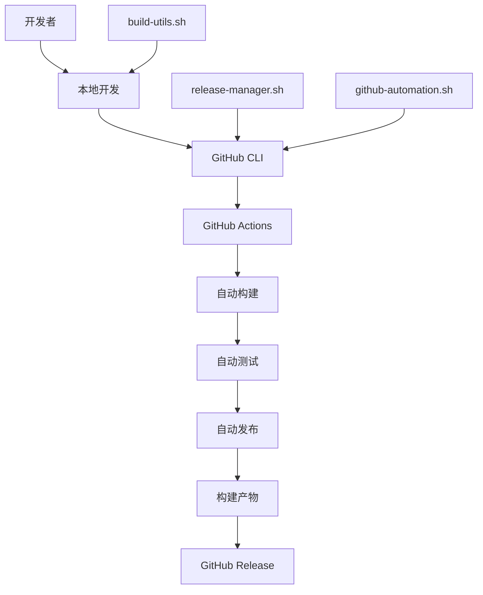

# 自动化发布系统总结

本文档总结了 Git Worktree CLI 项目的完整自动化发布系统，包括 GitHub Actions 工作流、GitHub CLI 集成和自动化脚本。

## 🎯 系统概览

我们的自动化发布系统包含三个主要组件：

1. **GitHub Actions 工作流** - 云端自动化 CI/CD
2. **GitHub CLI 集成** - 命令行自动化工具
3. **自动化脚本** - 本地开发和发布工具



## 📦 组件详解

### 1. GitHub Actions 工作流

#### 主要工作流文件

**[`.github/workflows/release.yml`](release.yml)**
- **触发条件**: 推送 `v*` 标签或手动触发
- **功能**: 完整的发布流程自动化
- **包含步骤**:
  - 代码质量检查 (lint, test, build)
  - 多平台构建 (Linux/macOS/Windows x86_64/ARM64)
  - 自动创建 GitHub Release
  - 上传构建产物和校验和
  - 生成发布说明

**[`.github/workflows/ci.yml`](ci.yml)**
- **触发条件**: 推送到 main/develop 分支，PR 创建
- **功能**: 持续集成和代码质量检查
- **包含步骤**:
  - 代码格式化和 lint 检查
  - 单元测试和集成测试
  - 跨平台构建测试
  - 安全扫描
  - 性能测试

**[`.github/workflows/automation.yml`](automation.yml)**
- **触发条件**: 手动触发
- **功能**: 仓库管理和自动化任务
- **包含功能**:
  - 创建和管理仓库
  - 同步标签配置
  - Issue 和 PR 管理
  - 清理旧资源

#### 工作流特点

✅ **多平台支持**: Linux/macOS/Windows x86_64/ARM64  
✅ **自动化测试**: 单元测试、集成测试、性能测试  
✅ **安全检查**: gosec 扫描、依赖漏洞检查  
✅ **智能缓存**: Go 模块缓存加速构建  
✅ **并行构建**: 矩阵策略并行构建多平台  
✅ **自动发布**: 标签推送自动触发完整发布流程

### 2. GitHub CLI 集成

#### 核心功能

**认证和配置**
```bash
# 安装和认证
gh auth login                                    # 交互式认证
echo "TOKEN" | gh auth login --with-token         # Token 认证

# 验证状态
gh auth status                                   # 检查认证状态
```

**仓库管理**
```bash
# 仓库操作
gh repo create my-repo --public                  # 创建仓库
gh repo view owner/repo                          # 查看仓库信息
gh repo clone owner/repo                         # 克隆仓库
```

**发布管理**
```bash
# 发布操作
gh release create v1.0.0 --title "Release"       # 创建发布
gh release list                                  # 列出发布版本
gh release upload v1.0.0 file.zip                # 上传资产
```

**工作流管理**
```bash
# CI/CD 操作
gh workflow list                                 # 列出工作流
gh workflow run ci.yml --ref branch              # 触发工作流
gh run list                                      # 查看运行历史
gh run view 123456789                            # 查看运行详情
```

### 3. 自动化脚本

#### 脚本概览

| 脚本 | 功能 | 使用场景 |
|------|------|----------|
| `release-manager.sh` | 完整的发布管理 | 交互式发布、版本管理 |
| `github-automation.sh` | GitHub 自动化 | 仓库管理、CI/CD 控制 |
| `build-utils.sh` | 构建和开发工具 | 高级构建、测试、分析 |
| `setup-dev.sh` | 开发环境设置 | 环境初始化、工具安装 |

#### 特色功能

**交互式发布管理**
```bash
# 启动交互式发布
./scripts/release-manager.sh interactive

# 快速发布
./scripts/release-manager.sh quick

# 发布状态查看
./scripts/release-manager.sh status
```

**高级构建功能**
```bash
# 性能分析构建
./scripts/build-utils.sh profile

# 二进制大小分析
./scripts/build-utils.sh size-analysis

# 安全扫描
./scripts/build-utils.sh security-check
```

**GitHub 自动化**
```bash
# 仓库自动化管理
./scripts/github-automation.sh setup-repo
./scripts/github-automation.sh sync-labels
./scripts/github-automation.sh create-release 1.0.0
```

## 🚀 使用流程

### 1. 开发环境设置

```bash
# 克隆项目
git clone https://github.com/tinsfox/gwt.git
cd gwt

# 自动设置开发环境
./scripts/setup-dev.sh

# 验证环境
make build
make test
```

### 2. 日常开发工作流

```bash
# 开始开发
make dev                    # 启动热重载开发模式

# 代码检查
make check                  # 运行所有代码检查
make test                   # 运行测试

# 构建验证
make build                  # 构建当前平台
make build-all             # 构建所有平台
```

### 3. 发布流程

#### 方法一：交互式发布（推荐）
```bash
# 启动交互式发布
./scripts/release-manager.sh interactive

# 按照提示选择发布类型和选项
# 脚本会自动处理整个发布流程
```

#### 方法二：快速发布
```bash
# 快速发布补丁版本
./scripts/release-manager.sh quick

# 快速发布指定类型
./scripts/release-manager.sh quick --type minor
```

#### 方法三：GitHub Actions 自动发布
```bash
# 创建并推送标签（自动触发 GitHub Actions）
git tag -a v1.0.0 -m "Release v1.0.0"
git push origin v1.0.0

# 或者手动触发工作流
gh workflow run release.yml --field version="1.0.0"
```

### 4. 发布验证

```bash
# 检查发布状态
./scripts/release-manager.sh status
./scripts/release-manager.sh list

# 验证下载文件
wget https://github.com/tinsfox/gwt/releases/download/v1.0.0/checksums.txt
sha256sum -c checksums.txt
```

## 📋 发布类型说明

### 发布类型

1. **Major Release (主版本)**
   - 版本格式：`X.0.0`
   - 包含破坏性变更
   - 需要详细的迁移指南

2. **Minor Release (次版本)**
   - 版本格式：`X.Y.0`
   - 向后兼容的新功能
   - 推荐的常规发布类型

3. **Patch Release (补丁版本)**
   - 版本格式：`X.Y.Z`
   - 仅包含 bug 修复
   - 最频繁的发布类型

4. **Prerelease (预发布)**
   - 版本格式：`X.Y.Z-pre.N`
   - 用于测试的版本
   - 不会标记为最新发布

### 版本计算规则

```
当前版本: 1.2.3

major  -> 2.0.0
minor  -> 1.3.0
patch  -> 1.2.4
prerelease -> 1.2.4-pre.1
```

## 🔧 配置选项

### 环境变量

```bash
# GitHub 配置
export GITHUB_TOKEN="your_token"           # GitHub 个人访问令牌
export GITHUB_OWNER="your-username"        # 默认仓库所有者

# 项目配置
export PROJECT_NAME="gwt"                  # 项目名称
export VERSION_FILE="VERSION"              # 版本文件
export CHANGELOG_FILE="CHANGELOG.md"       # 变更日志文件

# 构建配置
export GO_VERSION="1.21"                   # Go 版本
export PLATFORMS="linux/amd64,darwin/amd64,windows/amd64"  # 构建平台
```

### 工作流配置

在 `.github/workflows/release.yml` 中可以配置：

- **触发条件**: 标签模式、分支限制
- **构建平台**: 目标操作系统和架构
- **测试要求**: 必须通过的检查
- **发布设置**: 草稿、预发布选项

## 📊 构建产物

### 标准发布包含

```
Release v1.0.0/
├── gwt-linux-amd64.tar.gz          # Linux x86_64
├── gwt-linux-arm64.tar.gz          # Linux ARM64
├── gwt-darwin-amd64.zip            # macOS x86_64
├── gwt-darwin-arm64.zip            # macOS ARM64 (M1/M2)
├── gwt-windows-amd64.zip           # Windows x86_64
├── checksums.txt                   # SHA256 校验和
└── release-notes.md               # 发布说明
```

### 校验和验证

```bash
# 下载校验和文件
wget https://github.com/tinsfox/gwt/releases/download/v1.0.0/checksums.txt

# 验证下载的文件
sha256sum -c checksums.txt

# 手动验证单个文件
sha256sum gwt-linux-amd64.tar.gz
grep gwt-linux-amd64.tar.gz checksums.txt
```

## 🛡️ 安全考虑

### Token 安全
- 使用最小权限原则
- 定期轮换访问令牌
- 不在代码中硬编码令牌
- 使用 GitHub Secrets 存储敏感信息

### 构建安全
- 使用官方 GitHub Actions
- 验证第三方 Action 的来源
- 启用工作流审计日志
- 定期更新依赖包

### 发布安全
- 自动生成校验和
- 验证构建产物的完整性
- 使用分支保护规则
- 要求代码审查

## 🚨 故障排除

### 常见问题

#### 1. 发布创建失败
```bash
# 检查 Git 状态
git status

# 检查标签是否存在
git tag -l v1.0.0

# 检查工作流状态
gh run list --workflow=release.yml
```

#### 2. 构建失败
```bash
# 检查依赖
make deps

# 清理构建缓存
make clean

# 详细构建输出
make build VERBOSE=1
```

#### 3. 认证失败
```bash
# 检查认证状态
gh auth status

# 重新认证
gh auth login

# 检查 Token 权限
gh api user --jq '.login'
```

#### 4. 工作流触发失败
```bash
# 检查工作流文件
ls -la .github/workflows/

# 验证工作流语法
gh workflow view release.yml

# 手动触发工作流
gh workflow run release.yml
```

### 调试技巧

#### 启用详细模式
```bash
# 详细输出
./scripts/release-manager.sh --verbose interactive

# 试运行模式
./scripts/github-automation.sh --dry-run status
```

#### 查看日志
```bash
# GitHub Actions 日志
gh run view 123456789 --log

# 本地构建日志
make build 2>&1 | tee build.log
```

#### 网络诊断
```bash
# 检查 GitHub API 连接
curl -I https://api.github.com

# 检查 DNS 解析
nslookup api.github.com
```

## 📈 最佳实践

### 1. 版本管理
- 遵循语义化版本规范
- 保持版本历史清晰
- 及时创建发布说明
- 维护变更日志

### 2. 发布策略
- 定期发布小版本
- 充分测试预发布版本
- 提供详细的发布说明
- 保持向后兼容性

### 3. 协作流程
- 使用分支保护规则
- 要求代码审查
- 自动化测试和检查
- 及时响应 Issues

### 4. 监控和维护
- 监控 CI/CD 状态
- 定期检查安全扫描结果
- 更新依赖和工具
- 收集用户反馈

## 🎯 快速参考

### 最常用的命令

```bash
# 开发环境设置
./scripts/setup-dev.sh

# 交互式发布（推荐）
./scripts/release-manager.sh interactive

# 快速发布
./scripts/release-manager.sh quick

# 检查发布状态
./scripts/release-manager.sh status

# 触发 GitHub Actions 发布
git tag -a v1.0.0 -m "Release v1.0.0"
git push origin v1.0.0
```

### 工作流状态检查

```bash
# 查看所有工作流
gh workflow list

# 查看最近运行
gh run list --limit 10

# 查看特定工作流状态
gh run view 123456789
```

### 发布管理

```bash
# 列出发布版本
./scripts/release-manager.sh list

# 查看发布详情
./scripts/release-manager.sh status v1.0.0

# 回滚发布
./scripts/release-manager.sh rollback v1.0.0
```

---

## 📞 支持和反馈

### 获取帮助
- [GitHub CLI 文档](https://cli.github.com/manual/)
- [项目文档](README.md)
- [开发指南](DEVELOPMENT.md)
- [构建指南](BUILD_GUIDE.md)

### 报告问题
- 使用 GitHub Issues 报告问题
- 提供详细的错误信息和复现步骤
- 包含环境信息和日志

### 贡献改进
- 欢迎提交改进建议
- 参与文档完善
- 分享使用经验

**Happy Releasing!** 🚀