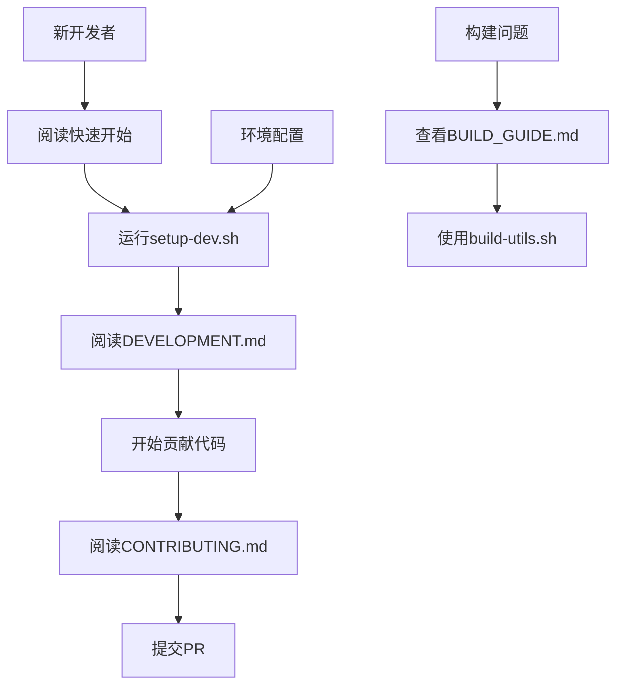

# 开发文档目录

欢迎来到 Git Worktree CLI 的开发文档中心！这里包含了完整的开发指南、构建说明和贡献规范。

## 📚 文档导航

### 🚀 快速开始
- **[快速开始指南](QUICK_START.md)** - 5分钟上手开发环境
- **[开发环境设置](../scripts/setup-dev.sh)** - 自动化环境配置脚本

### 📖 核心开发文档
- **[开发文档](../DEVELOPMENT.md)** - 详细的开发环境搭建、架构设计和开发流程
- **[构建指南](BUILD_GUIDE.md)** - 完整的构建系统说明和发布流程
- **[贡献指南](../CONTRIBUTING.md)** - 如何为项目贡献代码和文档

### 🛠️ 工具和脚本
- **[构建工具脚本](../scripts/build-utils.sh)** - 高级构建和开发工具
- **[安装脚本](../scripts/install.sh)** - 用户安装脚本

### 📋 项目信息
- **[主README](../README.md)** - 项目概览和使用说明
- **[需求文档](../git-worktree-cli-requirements.md)** - 功能需求详细说明
- **[编辑器集成详情](../editor-integration-details.md)** - 支持的编辑器列表

## 🎯 开发工作流



## 📁 文档结构

```
docs/
├── README.md              # 本文档 - 文档索引
├── QUICK_START.md         # 快速开始指南
├── BUILD_GUIDE.md         # 构建指南
├── examples/              # 示例代码（可选）
└── architecture/          # 架构文档（可选）
```

## 🚀 5分钟开发环境搭建

```bash
# 1. 克隆项目
git clone https://github.com/tinsfox/gwt.git
cd gwt

# 2. 运行自动设置脚本
./scripts/setup-dev.sh

# 3. 验证环境
make build
./build/gwt --version

# 4. 运行测试
make test
```

## 📋 开发任务清单

### 环境准备 ✅
- [ ] 安装 Go 1.21+
- [ ] 安装 Git 2.6+
- [ ] 安装 Make 工具
- [ ] 运行 `./scripts/setup-dev.sh`
- [ ] 验证 `make build` 成功

### 第一次贡献 ✅
- [ ] 阅读 [CONTRIBUTING.md](../CONTRIBUTING.md)
- [ ] 创建功能分支
- [ ] 实现小功能或修复
- [ ] 添加测试用例
- [ ] 提交 Pull Request

### 深入了解 🔍
- [ ] 阅读 [DEVELOPMENT.md](../DEVELOPMENT.md) 了解架构
- [ ] 阅读 [BUILD_GUIDE.md](BUILD_GUIDE.md) 了解构建系统
- [ ] 探索 `internal/` 目录的代码结构
- [ ] 尝试添加新功能

## 💡 常用命令速查

### 开发命令
```bash
make dev          # 开发模式（热重载）
make build        # 构建项目
make test         # 运行测试
make check        # 代码质量检查
make run          # 构建并运行
```

### 高级命令
```bash
./scripts/build-utils.sh quick-build     # 快速构建
./scripts/build-utils.sh coverage        # 生成覆盖率报告
./scripts/build-utils.sh cross-compile   # 交叉编译
make release      # 构建发布版本
```

### 调试命令
```bash
export GWT_DEBUG=1
./build/gwt --verbose list
make dev-build    # 构建调试版本
```

## 🛠️ 开发工具推荐

### 必需工具
- **Go 1.21+** - 主要开发语言
- **Git 2.6+** - 版本控制
- **Make** - 构建工具

### 推荐编辑器
- **VS Code** + Go 扩展
- **GoLand** (JetBrains)
- **Vim/Neovim** + vim-go

### 开发辅助工具
- **goimports** - 自动导入管理
- **golint** - 代码风格检查
- **air** - 热重载开发
- **gosec** - 安全扫描
- **delve** - 调试器

## 📊 项目架构概览

```
gwt/
├── cmd/                    # 命令行接口
│   ├── list.go            # list 命令
│   ├── create.go          # create 命令
│   └── ...
├── internal/              # 内部业务逻辑
│   ├── git/               # Git 操作封装
│   ├── editor/            # 编辑器集成
│   └── ui/                # 用户界面
├── main.go               # 程序入口
├── Makefile              # 构建配置
├── go.mod                # 依赖管理
└── scripts/              # 构建和开发脚本
```

## 🎯 贡献方向

### 🟢 新手友好
- 文档改进
- 代码注释完善
- 测试用例补充
- 小的功能增强

### 🟡 中级挑战
- 新命令实现
- 性能优化
- 错误处理改进
- 跨平台兼容性

### 🔴 高级任务
- 架构重构
- 插件系统设计
- 团队协作功能
- 图形界面开发

## 🤝 社区参与

### 讨论渠道
- [GitHub Issues](https://github.com/tinsfox/gwt/issues) - 问题报告和功能建议
- [GitHub Discussions](https://github.com/tinsfox/gwt/discussions) - 一般讨论
- [Pull Requests](https://github.com/tinsfox/gwt/pulls) - 代码贡献

### 行为准则
我们遵循 [Contributor Covenant](https://www.contributor-covenant.org/) 行为准则，致力于建设友好和包容的社区。

## 📞 获取帮助

### 常见问题
1. **构建失败** - 查看 [BUILD_GUIDE.md](BUILD_GUIDE.md) 的故障排除部分
2. **测试失败** - 确保在 Git 仓库中运行测试
3. **环境配置** - 重新运行 `./scripts/setup-dev.sh`

### 寻求帮助
- 在 [GitHub Issues](https://github.com/tinsfox/gwt/issues) 创建问题
- 在 [GitHub Discussions](https://github.com/tinsfox/gwt/discussions) 发起讨论
- 查看现有文档和代码注释

## 🎉 下一步

根据你的目标和经验水平，选择合适的文档继续：

### 新开发者
1. 📖 阅读 [QUICK_START.md](QUICK_START.md)
2. 🔧 运行 `./scripts/setup-dev.sh`
3. 💻 开始你的第一个贡献

### 有经验的开发者
1. 🏗️ 阅读 [DEVELOPMENT.md](../DEVELOPMENT.md) 了解架构
2. 🔨 阅读 [BUILD_GUIDE.md](BUILD_GUIDE.md) 了解构建系统
3. 🎯 选择感兴趣的功能进行开发

### 贡献者
1. 🤝 阅读 [CONTRIBUTING.md](../CONTRIBUTING.md)
2. 🧪 了解测试要求
3. 📋 查看待办事项和路线图

---

**Happy Coding!** 🚀

*有任何问题或建议，请随时在 [GitHub Issues](https://github.com/tinsfox/gwt/issues) 中提出。*